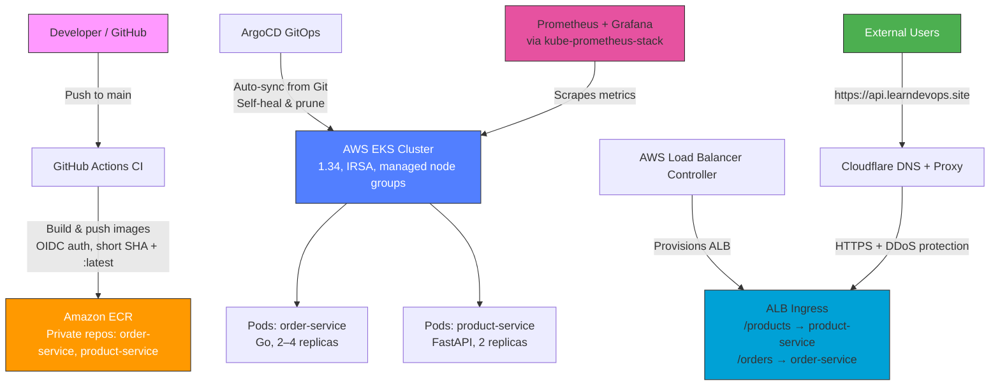
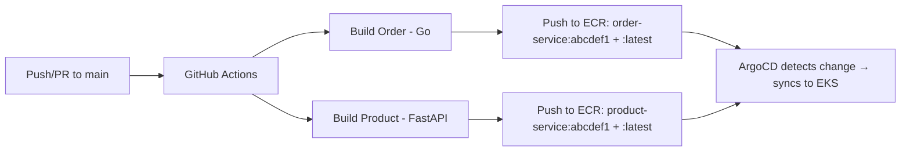

# 🚀 Production-Grade DevOps Microservices Portfolio

[](https://www.terraform.io)
[](https://kubernetes.io)
[](https://aws.amazon.com/eks/)
[](https://argoproj.github.io/cd/)
[](https://github.com/features/actions)
[](https://docker.com)

> End-to-end microservices platform with secure CI/CD, GitOps, EKS on AWS, ALB Ingress, monitoring (Prometheus + Grafana), and custom domain via Cloudflare.

**Live Demo:**  
(Down now because I am saving cost on AWS)
🔗 https://api.learndevops.site/products  
🔗 https://api.learndevops.site/orders

---

## 📋 Table of Contents

- [Overview](#-overview)
- [Architecture](#-architecture)
- [Tech Stack](#-tech-stack)
- [Project Structure](#-project-structure)
- [Microservices](#-microservices)
- [CI/CD Pipeline](#-cicd-pipeline)
- [Infrastructure (Terraform + EKS)](#-infrastructure-terraform--eks)
- [GitOps with ArgoCD](#-gitops-with-argocd)
- [External Access (ALB + Cloudflare)](#-external-access-alb--cloudflare)
- [Monitoring (Prometheus + Grafana)](#-monitoring-prometheus--grafana)
- [Security & Best Practices](#-security--best-practices)
- [Cost Management](#-cost-management)
- [Skills Demonstrated](#-skills-demonstrated)
- [Screenshots](#-screenshots)
- [Getting Started](#-getting-started)
- [Cleanup](#-cleanup)
- [Future Improvements](#-future-improvements)
- [Author](#-author)

---

## 🎯 Overview

This project is a **real-world, production-grade microservices platform** built to demonstrate modern DevOps practices.

It includes:
- Secure CI/CD with GitHub Actions + OIDC (no long-lived secrets)
- Infrastructure as Code with Terraform (VPC + EKS)
- GitOps deployment with ArgoCD
- External access via AWS ALB Ingress + Cloudflare DNS & free SSL
- Monitoring with Prometheus + Grafana
- Custom domain (`api.learndevops.site`)

---

## 🏗️ Architecture



### Data Flow

1. Developer pushes code → GitHub Actions builds & pushes images to ECR
2. ArgoCD detects Git change → syncs manifests to EKS
3. EKS pulls images → deploys pods
4. ALB routes traffic → external access via api.learndevops.site
5. Prometheus scrapes metrics → Grafana visualizes cluster + pod health

---

## 🛠️ Tech Stack

| Category | Technology | Purpose / Why Chosen |
|----------|------------|----------------------|
| Cloud | AWS (EKS, ECR, VPC, IAM, ALB) | Enterprise standard, managed Kubernetes, deep integration |
| IaC | Terraform + Modules | Reproducible, state locking (S3/DynamoDB), modular |
| Container Registry | Amazon ECR | Integrated with EKS, scan on push, free tier |
| Orchestration | Amazon EKS 1.34 | Managed control plane, IRSA, addons (CNI, CoreDNS, EBS CSI) |
| CI/CD | GitHub Actions + OIDC | Secure (no secrets), matrix builds, path filtering |
| GitOps | ArgoCD | Declarative sync, auto-prune, self-heal, UI visibility |
| Ingress | AWS Load Balancer Controller | Provisions ALB, path-based routing, integrates with Route 53 |
| Monitoring | Prometheus + Grafana (via blueprints) | Cluster + pod metrics, dashboards, alerts |
| DNS & SSL | Cloudflare (free proxy + universal SSL) | Fast DNS, free HTTPS, DDoS protection, no extra cost |
| Languages | Go (order) + Python/FastAPI (product) | Polyglot microservices demo |

---

## 📁 Project Structure

```
devops-production-microservices/
├── services/                    # Microservice source code
│   ├── order/                   # Go service
│   └── product/                 # Python/FastAPI service
├── k8s/                         # Kubernetes manifests (Kustomize)
│   └── base/                    # Base manifests + kustomization.yaml
├── argocd/                      # ArgoCD configuration
│   └── applications/            # Application manifests
├── terraform/                   # Infrastructure as Code
│   ├── main.tf                  # Root module
│   ├── providers.tf
│   ├── outputs.tf
│   ├── vpc/
│   └── eks/
├── .github/workflows/           # CI/CD pipelines
└── README.md
```

---

## 🔧 Microservices

| Service | Language | Port | Path | Description |
|---------|----------|------|------|-------------|
| Order | Go | 8080 | /orders | Order processing API |
| Product | Python/FastAPI | 3000 | /products | Product catalog API |

Both services include:
- Health endpoints (`/health`)
- Graceful shutdown
- Structured logging
- Resource limits & requests
- Non-root containers

---

## 🔄 CI/CD Pipeline

**GitHub Actions Workflow** (`.github/workflows/ci-build-push.yaml`)

- Triggers on push/PR to main
- Uses OIDC for secure AWS access (no secrets in GitHub)
- Matrix strategy: builds both services in parallel
- Tags images with short SHA + `:latest`
- Pushes to Amazon ECR



---

## ☸️ Infrastructure (Terraform + EKS)

**`terraform/main.tf`** (simplified)

- VPC with public/private subnets, NAT gateway
- EKS cluster (1.34) with IRSA, public/private endpoint
- Managed node groups (t3.medium, 60 GiB gp3 volumes)
- IAM policies for nodes (CNI, ECR, SSM, EBS CSI)
- Blueprints addons module for ALB Controller + Prometheus/Grafana

> ⚠️ **Cost awareness:** ~$70–150/month when running — always destroy after demos.

---

## 🎯 GitOps with ArgoCD

- ArgoCD watches `k8s/base` in Git
- Auto-syncs Deployments, Services, Ingress
- `CreateNamespace=true` + `prune: true` + `selfHeal: true`
- Application manifest: `argocd/applications/microservices.yaml`

```yaml
spec:
  source:
    repoURL: https://github.com/elorm116/devops-production-microservices.git
    targetRevision: main
    path: k8s/base
  destination:
    namespace: microservices
  syncPolicy:
    automated:
      prune: true
      selfHeal: true
    syncOptions:
      - CreateNamespace=true
```

---

## 🌐 External Access (ALB + Cloudflare)

- AWS Load Balancer Controller provisions ALB from Ingress
- Cloudflare DNS + free proxy/SSL for `api.learndevops.site`
- Paths: `/products` → product-service, `/orders` → order-service

```yaml
# k8s/base/ingress/ingress.yaml
spec:
  ingressClassName: alb
  rules:
    - host: api.learndevops.site
      http:
        paths:
          - path: /products
            backend:
              service:
                name: product-service
                port: 80
          - path: /orders
            backend:
              service:
                name: order-service
                port: 80
```

---

## 📊 Monitoring (Prometheus + Grafana)

- Enabled via `eks-blueprints-addons`
- Prometheus scrapes cluster + pod metrics
- Grafana with default + imported dashboards (Kubernetes Cluster, Node Exporter, Pod Metrics)
- Persistent storage for data retention

**Access (temporary):**

```bash
kubectl port-forward -n monitoring svc/kube-prometheus-stack-grafana 3000:80
# → http://localhost:3000 (admin / your-password)
```

---

## 🔒 Security & Best Practices

- ✅ OIDC for GitHub Actions → no long-lived keys
- ✅ IRSA for pod permissions
- ✅ Non-root containers
- ✅ Resource requests/limits
- ✅ Private subnets + NAT
- ✅ Image scanning in ECR
- ✅ Cloudflare proxy + free SSL

---

## 💰 Cost Management

> ⚠️ EKS can cost ~$70–150/month — always destroy when done!

```bash
cd terraform
terraform destroy -auto-approve
```

---

## 🎓 Skills Demonstrated

- ✅ Infrastructure as Code (Terraform + modules)
- ✅ Secure CI/CD (GitHub Actions + OIDC)
- ✅ GitOps (ArgoCD auto-sync, prune, self-heal)
- ✅ Kubernetes (Deployments, Services, Ingress, Probes)
- ✅ AWS EKS (IRSA, managed node groups, addons)
- ✅ Monitoring (Prometheus + Grafana)
- ✅ DNS + SSL (Cloudflare proxy)
- ✅ Troubleshooting (CrashLoopBackOff, OOMKilled, IAM issues)

---

## 📸 Screenshots

<!-- Add your screenshots here -->

---

## 🧹 Cleanup

```bash
# Delete ArgoCD apps first
kubectl delete -n argocd -f argocd/applications/

# Destroy infrastructure
cd terraform
terraform destroy -auto-approve
```

---

## 👤 Author

**Anthony Elorm Zottor**

Portfolio project demonstrating modern DevOps practices.

[](https://github.com/elorm116)
[](https://linkedin.com)

---

*Built with determination and coffee ☕*

⭐ **If this helped you, please star the repo!**

---

## 🚀 Happy Deploying!
