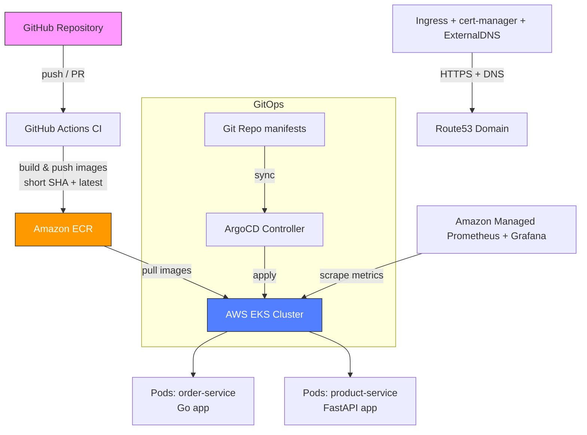

[](https://terraform.io)
[](https://kubernetes.io)
[](https://aws.amazon.com/eks/)
[](https://docker.com)


### Deploy Infrastructure

```bash
# Clone the repository
git clone https://github.com/<your-username>/devops-production-microservices.git
cd devops-production-microservices/terraform

# Initialize and apply
terraform init
terraform plan
terraform apply
```

### Configure kubectl

```bash
aws eks update-kubeconfig --region us-east-1 --name devops-prod-eks
```

### Deploy Services

```bash
# Apply Kubernetes manifests
kubectl apply -f k8s/deployments/
kubectl apply -f k8s/services/
kubectl apply -f k8s/ingress/
```

### Run Locally (Development)

```bash
# Auth service
cd services/auth-node && npm install && npm start

# Product service
cd services/product-python && pip install -r requirements.txt && uvicorn main:app --reload

# Order service
cd services/order-go && go run main.go
```

---

## 🔒 Security Considerations

- **Private Subnets**: Worker nodes run in private subnets
- **NAT Gateway**: Outbound internet access without public IPs
- **KMS Encryption**: EKS secrets encrypted at rest
- **IAM Roles**: Least-privilege access for nodes and CI/CD
- **Secret Management**: Credentials stored in GitHub Secrets / Jenkins credentials
- **Resource Limits**: Prevents noisy neighbor issues in pods

---

## 💰 Cost Optimization

This project is designed for **learning and demonstration**:

- Infrastructure is destroyed after demos to minimize costs
- Uses `t3.micro` and `t3.small` instances
- Single NAT Gateway (not HA) to reduce costs
- Can scale up for production workloads

**Estimated cost**: ~$70-100/month when running

---

## 📈 Future Improvements

- [ ] Add Prometheus + Grafana monitoring
- [ ] Implement service mesh (Istio/Linkerd)
- [ ] Add database layer (RDS/DynamoDB)
- [ ] Implement GitOps with ArgoCD
- [ ] Add Ansible for configuration management
- [ ] Implement blue/green deployments
- [ ] Add automated security scanning (Trivy, Snyk)

---

## 🎓 Skills Demonstrated

This project showcases proficiency in:

- **Cloud Platforms**: AWS (EKS, ECR, VPC, IAM, KMS, S3)
- **Container Orchestration**: Kubernetes (Deployments, Services, Ingress, ConfigMaps)
- **Infrastructure as Code**: Terraform (modules, state management, workspaces)
- **CI/CD**: GitHub Actions, Jenkins
- **Containerization**: Docker (multi-stage builds, optimization)
- **Programming**: Node.js, Python, Go
- **Networking**: VPC design, subnets, NAT, load balancing
- **Security**: IAM, secrets management, encryption

---


---------------------------------

# DevOps Production Microservices -- More Modern Design

A modern, production-grade microservices portfolio project built with:

Microservices: Order (Go) + Product (FastAPI/Python)
CI/CD: GitHub Actions with OIDC (no long-lived secrets), matrix builds, short SHA tagging
Container Registry: AWS ECR (private repos)
Orchestration: Amazon EKS (Kubernetes 1.34)
GitOps: ArgoCD for declarative sync from Git
External Access: AWS ALB Ingress (via AWS Load Balancer Controller)
IaC: Terraform (VPC + EKS + IRSA)
Security: OIDC, IRSA, non-root containers, least-privilege IAM

## Current Stack

- AWS EKS
- Terraform (VPC + EKS + ECR)
- GitHub Actions CI per service
- Kubernetes manifests 
- GitOps (ArgoCD)

## Services

| Service  | Language   | New folder name    | Status      |
|----------|------------|--------------------|-------------|
| Auth     | Node.js    | `services/auth`    | archived |
| Product  | Python     | `services/product` | keep        |
| Order    | Go         | `services/order`   | keep        |

## Planned Modernization Path

1. Clean structure & drop Jenkins
2. Modern GitHub Actions CI
3. Introduce ArgoCD ApplicationSets + Kustomize
4. cert-manager + ExternalDNS + real TLS
5. Amazon Managed Prometheus + Grafana
6. External Secrets Operator
7. Architecture diagrams + ADRs
8. Nice demo video


## Architecture Overview



Current flow: GitHub → CI → ECR → ArgoCD → EKS → ALB → external traffic

## Project Structure

devops-production-microservices/
├── services/
│   ├── order/                # Go microservice
│   │   ├── Dockerfile
│   │   ├── main.go
│   │   └── go.mod
│   └── product/              # FastAPI microservice
│       ├── Dockerfile
│       ├── main.py
│       └── requirements.txt
├── k8s/
│   └── base/                 # Kustomize base
│       ├── kustomization.yaml
│       ├── deployments/
│       ├── services/
│       ├── ingress/
│       └── config/
├── argocd/
│   └── applications/
│       └── microservices.yaml  # ArgoCD Application
├── terraform/
│   ├── main.tf
│   ├── vpc/
│   ├── eks/
│   └── outputs.tf
└── .github/workflows/
    └── ci-build-push.yaml    # Unified CI with matrix + OIDC

## Key Technologies & Decisions

| Category        | Technology                         | Why this choice?                                                                 |
|-----------------|------------------------------------|----------------------------------------------------------------------------------|
| CI/CD           | GitHub Actions + OIDC              | Secure (no secrets), native to repo, matrix builds for parallel service pipelines |
| Image Registry  | AWS ECR (private)                  | Integrated with EKS, free tier, image scanning on push                            |
| Cluster         | Amazon EKS 1.34                    | Managed Kubernetes, IRSA support, managed addons (CNI, CoreDNS, EBS CSI)          |
| GitOps          | ArgoCD                             | Declarative sync, auto-prune/self-heal, UI for visibility                         |
| Ingress         | AWS Load Balancer Controller       | Provisions ALB, path-based routing, integrates with Route 53 (future)             |
| IaC             | Terraform + modules                | Reproducible infra, state locking (S3/DynamoDB), reusable outputs                 |
| Security        | OIDC, IRSA, non-root pods          | No long-lived keys, least privilege, reduced attack surface                       |


## Setup & Run (One-Time)

1. Prerequisites
AWS account with IAM permissions (EKS, ECR, VPC, IAM)
aws, kubectl, eksctl, helm, terraform, git

2. Bootstrap infrastructureBashcd terraform
terraform init
terraform apply   # ~20 min – creates VPC + EKS cluster
aws eks update-kubeconfig --region us-east-1 --name devops-prod-eks

3. Install ArgoCD
kubectl create namespace argocd
kubectl apply -n argocd -f https://raw.githubusercontent.com/argoproj/argo-cd/stable/manifests/install.yaml
kubectl wait --for=condition=available deployment/argocd-server -n argocd --timeout=300s
kubectl -n argocd get secret argocd-initial-admin-secret -o jsonpath="{.data.password}" | base64 -d
kubectl port-forward svc/argocd-server -n argocd 8080:443

4. Deploy via ArgoCD
The Application microservices is already in Git → ArgoCD auto-syncs on push.
Manual sync: ArgoCD UI → Applications → microservices → Sync

5. Access externally
After AWS Load Balancer Controller is installed and Ingress syncs:textkubectl get ingress microservices-ingress -n microservices
curl http://<alb-hostname>/products
curl http://<alb-hostname>/orders

## Screenshots

1. GitHub Actions CI run – matrix builds for order & product + ECR push
(CI Success)
2. ECR with short SHA + latest tags
(ECR Images)
3. ArgoCD UI – Synced Application 
(ArgoCD Synced)
4. kubectl get pods – Running services 
(Pods Running)
5. ALB Ingress hostname 
(ALB Hostname)
6. curl response from /products 
(External Access)


## Cleanup (Important!)

Bashcd terraform
terraform destroy   # destroys EKS + VPC (takes ~20 min)

Never leave EKS running — costs ~$70–150/month.


## 📄 License

This project is for educational and portfolio purposes.
*Built as a portfolio project demonstrating production-grade DevOps practices.*
---

## 👤 Author

**Anthony Elorm Zottor**
- LinkedIn: [(https://www.linkedin.com/in/aezottor/)]
- GitHub: [(https://github.com/elorm116)]
- Email: [aezottor.@gmail.com]

Happy deploying! 🚀
---

